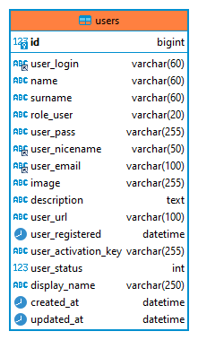

# Laravel0  
**Fecha de Creacion:** _17 de Agosto del 2023_  
**Descripción:** proyecto que tiene la finalidad de servir de base para otros. 
**Version del laravel:** _9.52.15_  
**Version del PHP:** _PHP 8.1.13 (cli) (built: Nov 22 2022 15:49:14)_  

## Base de Datos ##  
**Tabla:** _users_  
**Estructura de la tabla users**  

### Paso 1. Crear un nuevo proyecto a partir de este ###  
git clone https://github.com/techjesusparra/laravel0.git nuevo_proyecto  

## Configuraciones ##  
### Paso 2. Creacion de una base de datos y su configuracion ###  
Crear una base de dato e insertar un usuario administrador de la aplicacion
Es script lo encontrar en el directorio **SQL** dentro del proyecto con el nombre de **laravel0-DB.sql**, puede opcionalmente modificar los datos antes de realizar el insert.

DB_CONNECTION=_mysql_  
DB_HOST=_<Servidor de la base de datos>_  
DB_PORT=_3306_  
DB_DATABASE=_<Nombre de la base de datos>_  
DB_USERNAME=_<Usuario de la base de datos>_  
DB_PASSWORD=_<Contraseña>_  

### Paso 2. Prueba del ORM del Modelo Usuario ###  
